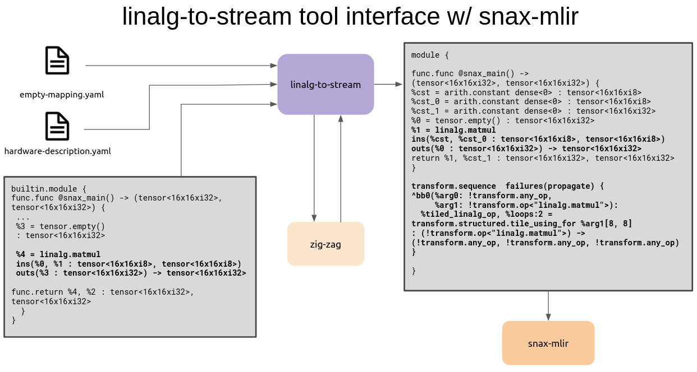

# Linalg to Stream

## End-Goal Linalg-to-Stream Tool Responsibilities

1. take in as input MLIR with linalg operations
2. for each linalg generic operation, 
   1. generate an equivalent ZigZag workload object
   2. feed this workload + a hardware description to zigzag
   3. parse the ZigZag output, including converting the prescribed loop bounds into tile sizes
   4. annotate the linalg operation with the ZigZag-prescribed tile size

3. output annotated MLIR, ***including an accompanying transform dialect script encoding the tiling transformation of each linalg operation***



## Current Functionality

Annotates a linalg matmul with a unique ID, and outputs corresponding ZigZag workload to a file.

## Set up

Install dependencies

```
pip install -r requirements.txt
```

## Running the tool

#### Run an Example

```
sh run.sh tests/matmul.mlir inputs/hardware/snax_gemm.py inputs/mapping/snax_gemm.py ./myWorkload.yaml
```

To view zigzag workload, do

```
cat ./myWorkload.yaml
```

#### Run a Regression Test

```
sh run_test.sh matmul snax_gemm.py snax_gemm.py
```

To view zigzag workload, do

```
cat tests/workloads/matmul.workload.out.yaml
```


...

## old documentation below - less relevant, but preserving here for reference

## running the tool

```
python xdsl_opt_main.py tests/matmul.mlir -p linalg-to-stream
```

### limitations

- Currently tool can only take in a single linalg generic operation
- The linalg generic operation must be a matrix multiply

### future work

- handle multiple linalg generic operations, assigning a unique id to each, which is then added as as attribute to the mlir operation

- figure out dependencies between linalg generic operations, and record this relationship in the workload objects using the unique ids

- handle case where linalg generic has more than three operands (we are assuming the first two operands are inputs, and the last operand is an output) Quantized operations have more than two inputs, and we would like to support these.

  Example of a quantized operation we want to support:

  ```
  func.func @simple_matmul(%arg0: memref<16x16xi8>, %arg1: memref<16x16xi8, strided<[1, 16], offset:0>>, %arg2: memref<16x16xi32>) {
  %c0_i32 = arith.constant 0 : i32
  linalg.quantized_matmul ins(%arg0, %arg1, %c0_i32, %c0_i32 : memref<16x16xi8>, memref<16x16xi8, strided<[1, 16], offset:0>>, i32, i32) outs(%arg2 : memref<16x16xi32>)
  return
  }
  ```

  gobolt.org MLIR opt (trunk) `--linalg-generalize-named-ops --mlir-print-local-scope --mlir-print-op-generic`

  ```
  "builtin.module"() ({
    "func.func"() <{function_type = (memref<16x16xi8>, memref<16x16xi8, strided<[1, 16]>>, memref<16x16xi32>) -> (), sym_name = "simple_matmul"}> ({
    ^bb0(%arg0: memref<16x16xi8>, %arg1: memref<16x16xi8, strided<[1, 16]>>, %arg2: memref<16x16xi32>):
      %0 = "arith.constant"() <{value = 0 : i32}> : () -> i32
      "linalg.generic"(%arg0, %arg1, %0, %0, %arg2) <{indexing_maps = [affine_map<(d0, d1, d2) -> (d0, d2)>, affine_map<(d0, d1, d2) -> (d2, d1)>, affine_map<(d0, d1, d2) -> ()>, affine_map<(d0, d1, d2) -> ()>, affine_map<(d0, d1, d2) -> (d0, d1)>], iterator_types = [#linalg.iterator_type<parallel>, #linalg.iterator_type<parallel>, #linalg.iterator_type<reduction>], operandSegmentSizes = array<i32: 4, 1>}> ({
      ^bb0(%arg3: i8, %arg4: i8, %arg5: i32, %arg6: i32, %arg7: i32):
        %1 = "arith.extsi"(%arg3) : (i8) -> i32
        %2 = "arith.subi"(%1, %arg5) <{overflowFlags = #arith.overflow<none>}> : (i32, i32) -> i32
        %3 = "arith.extsi"(%arg4) : (i8) -> i32
        %4 = "arith.subi"(%3, %arg6) <{overflowFlags = #arith.overflow<none>}> : (i32, i32) -> i32
        %5 = "arith.muli"(%2, %4) <{overflowFlags = #arith.overflow<none>}> : (i32, i32) -> i32
        %6 = "arith.addi"(%arg7, %5) <{overflowFlags = #arith.overflow<none>}> : (i32, i32) -> i32
        "linalg.yield"(%6) : (i32) -> ()
      }) : (memref<16x16xi8>, memref<16x16xi8, strided<[1, 16]>>, i32, i32, memref<16x16xi32>) -> ()
      "func.return"() : () -> ()
    }) : () -> ()
  }) : () -> ()
  ```

Note: None of the MLIR matrix operations take padding as input, so we know all the workloads produced from linalg should have 0 padding.

Tests To Make:

- vector x vector ; elementwise multiplication
- conv2D
- Conv 1D
- Depthwise Conv2D*
- Pointwise Conv2D
- Matrix-vector multi.
- matrix-martix multiply

### feed output of tool into zigzag

```
python run_zigzag.py 
```
### feed output of tool into stream (need to fix)

```
python run_stream.py
```
[Errors we're getting documented here](https://github.com/EmilySillars/stream-zigzag-input-output-linalg/tree/add-linalg-as-output-from-stream/linalg-input-output)
